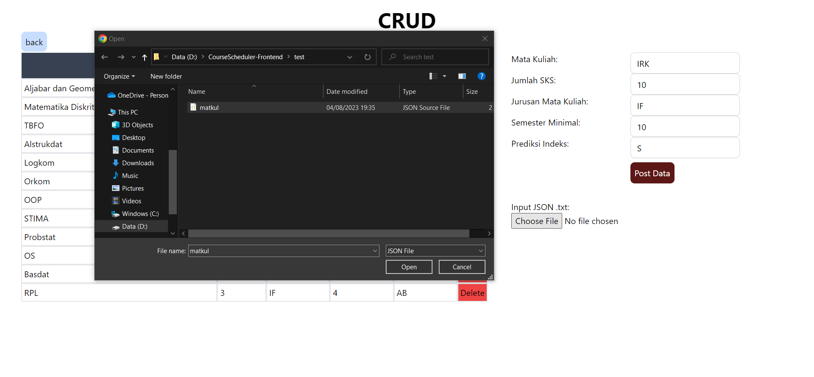

# Course Scheduler🎲
>Tugas Seleksi IRK

## Table of Contents
* [Contributors](#contributors)
* [General Information](#general-information)
* [Local Setup](#local-setup)
* [How to Use](#how-to-use)
* [File Input Structure](#file-input-structure)
* [Frameworks and Technologies](#frameworks-and-technologies)
* [References](#references)

## Contributors
| NIM | Nama |
| :---: | :---: |
| 13521021 | Bernardus Willson  |

## General Information 
The Course Scheduler is a program designed to assist students in planning their academic course schedules optimally. This program takes input data on courses along with important information such as the number of credit hours (SKS), the predicted level of difficulty, and the minimum semester required to take the course. Utilizing Dynamic Programming techniques, the program can calculate and determine the best combination of courses that a student can take in one semester, given a specific SKS constraint.

The main objective of this program is to find the combination of courses that yields the highest predicted score per SKS, enabling students to achieve the optimal grade while staying within the maximum SKS limit. The program's output will display the recommended courses along with the total predicted score per SKS obtained from the selected combination.

By using the Course Scheduler, students can efficiently plan their course schedules and maximize their academic achievements.

## Local Setup
<br>
1. Clone BE repo using the command below: 

```
git clone https://github.com/bernarduswillson/CourseScheduler-Frontend.git
```
<br>
2. Make sure you have docker installed, run the frontend using the command below:

```
docker-compose up -d
```
or alternatively, you can run the app manually using the command below:

```
yarn
```
```
yarn dev
```
<br>
3. The project will be served on port 3000

```
http://localhost:3000/
```


## How to Use
<br>
1. Input "Jurusan", "Semester Pengambilan", and "SKS" constraint on the right side of the page. Press "Search" to get the recommended courses.


<br>
2. If you want to modify the database, you can access the CRUD page by clicking the "CRUD" button on the top right corner of the page.


<br>
3. You can add new courses by filling the form on the right side of the page. Press "Post Data" to add the course to the database. Or you can add multiple courses by uploading a JSON file. Press "Choose File" to upload the file.



<br>
4. You can also delete existing courses by clicking the "Delete" button on the right side of each data.

## File Input Structure
For the file input, the structure of the JSON file should be as follows:
```
{
    "data": [
      {
        "nama_mk": "Aljabar dan Geometri",
        "sks": 3,
        "jurusan_mk": "IF",
        "semester_minimal": 3,
        "prediksi": "A"
      },
      {
        "nama_mk": "Matematika Diskrit",
        "sks": 3,
        "jurusan_mk": "IF",
        "semester_minimal": 3,
        "prediksi": "B"
      },
      {
        "nama_mk": "TBFO",
        "sks": 3,
        "jurusan_mk": "IF",
        "semester_minimal": 3,
        "prediksi": "AB"
      },
      {
        "nama_mk": "Alstrukdat",
        "sks": 4,
        "jurusan_mk": "IF",
        "semester_minimal": 3,
        "prediksi": "BC"
      },
      {
        "nama_mk": "Logkom",
        "sks": 2,
        "jurusan_mk": "IF",
        "semester_minimal": 3,
        "prediksi": "B"
      },
      {
        "nama_mk": "Orkom",
        "sks": 3,
        "jurusan_mk": "IF",
        "semester_minimal": 3,
        "prediksi": "AB"
      },
      {
        "nama_mk": "OOP",
        "sks": 3,
        "jurusan_mk": "IF",
        "semester_minimal": 4,
        "prediksi": "BC"
      },
      {
        "nama_mk": "STIMA",
        "sks": 3,
        "jurusan_mk": "IF",
        "semester_minimal": 4,
        "prediksi": "A"
      },
      {
        "nama_mk": "Probstat",
        "sks": 3,
        "jurusan_mk": "IF",
        "semester_minimal": 4,
        "prediksi": "A"
      },
      {
        "nama_mk": "OS",
        "sks": 3,
        "jurusan_mk": "IF",
        "semester_minimal": 4,
        "prediksi": "AB"
      },
      {
        "nama_mk": "Basdat",
        "sks": 3,
        "jurusan_mk": "IF",
        "semester_minimal": 4,
        "prediksi": "B"
      },
      {
        "nama_mk": "RPL",
        "sks": 3,
        "jurusan_mk": "IF",
        "semester_minimal": 4,
        "prediksi": "AB"
      }
    ]
  }
  
```

## Frameworks and Technologies
* [Next.js](https://nextjs.org/)
* [React.js](https://reactjs.org/)
* [Golang](https://golang.org/)
* [Gorm](https://gorm.io/)
* [Gin](https://gin-gonic.com/)
* [MySQL](https://www.mysql.com/)
* [Docker](https://www.docker.com/)

## References
* [0/1 Knapsack Problem Dynamic Programming](https://youtu.be/8LusJS5-AGo)